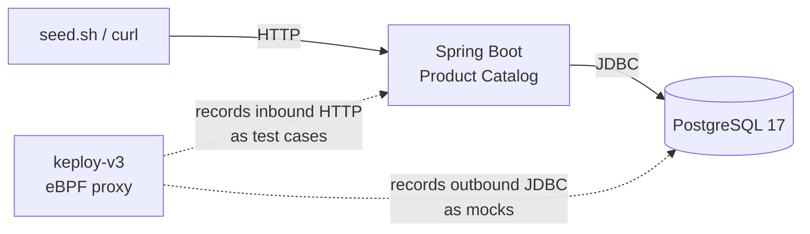

# Product Catalog — Spring Boot + PostgreSQL

A product-catalog REST API built with [Spring Boot](https://spring.io) and
[PostgreSQL](https://www.postgresql.org/), used to show Keploy replacing hand-written API
tests. Instead of JUnit fixtures, mocks, and assertions, Keploy **records real traffic
once** — capturing every downstream Postgres call as a mock — and replays it as a
regression suite that needs no database at all.

**Note** :- Issue Creation is disabled on this Repository, please visit [here](https://github.com/keploy/keploy/issues/new/choose) to submit Issue.

## What this sample shows

The recorded suite committed under `keploy/products-crud/` contains:

- **57 test cases** covering the full CRUD lifecycle, category filtering, and 404/400 edge cases
- **190 Postgres mocks**, so the database is stubbed on replay and the tests run anywhere
- **Zero hand-written assertions** — the recorded responses *are* the assertions
- **Auto-detected noise** — Keploy marks non-deterministic fields (`createdAt`, the `Date` header) itself

The payoff is `docker-compose.keploy.yml`, an app-only Compose file with no `postgres`
service at all. The suite still passes green, because every database call is served from
the recorded mocks.

| Traditional | Keploy |
|-------------|--------|
| Write test clients + assertions by hand | Record real traffic once |
| Manage a test database / fixtures | Downstream calls captured as mocks |
| Mocks drift from reality | Mocks *are* reality (recorded from the real DB) |
| Tests need infra to run | Replay is dependency-free |

## Architecture



Keploy sits in the network path via eBPF and records both sides at once: inbound HTTP
becomes test cases, outbound JDBC becomes mocks. The application needs no code changes.

## Pre-requisites

- [Docker](https://docs.docker.com/get-docker/) and Docker Compose — the app and database both run in containers
- No local Java or Maven needed; the multi-stage `Dockerfile` builds with a pinned Temurin 21 JDK

## Quick Keploy Installation

Based on your OS and preference (Docker/Native), you can set up Keploy using the one-click
installation method:

```sh
curl -O https://raw.githubusercontent.com/keploy/keploy/main/keploy.sh && source keploy.sh
```

## Setup the Product Catalog App

Clone the repository and start the stack:

```bash
git clone https://github.com/keploy/samples-java && cd samples-java/spring-boot-product-catalog

docker compose up --build
```

The API is now on `http://localhost:8080`. Tear down later with `docker compose down -v`.

## About the API

| Method   | Path                          | Description                                        | Success        |
|----------|-------------------------------|----------------------------------------------------|----------------|
| `POST`   | `/api/products`               | Create a product                                   | `201` + `Location` |
| `GET`    | `/api/products`               | List all products (optional `?category=`)          | `200`          |
| `GET`    | `/api/products/summary`       | Inventory rollup (optional `?lowStockThreshold=`)  | `200`          |
| `GET`    | `/api/products/{id}`          | Fetch one product                                  | `200` / `404`  |
| `PUT`    | `/api/products/{id}`          | Replace a product                                  | `200` / `404`  |
| `PATCH`  | `/api/products/{id}/stock`    | Adjust stock by a `delta`                          | `200` / `404` / `409` |
| `DELETE` | `/api/products/{id}`          | Delete a product                                   | `204` / `404`  |

A product has `name` (required, ≤120 chars), `description` (optional, ≤1000 chars),
`price` (required, > 0), `stockQuantity` (required, ≥ 0), and `category`. Validation
failures return `400` with a structured `fieldErrors` map, which is what produces the
recorded 400 traffic.

> The committed test set covers CRUD, category filters, and the 404/400 paths. It was
> recorded before `/summary` and `/{id}/stock` were added, so those two endpoints are not
> in it yet. The curl walkthrough below now exercises them, so a fresh re-record (or a
> `./seed.sh` run) picks them up.

## Capture the testcases

Keploy brings the whole stack up itself in record mode. In **terminal A**:

```bash
keploy record -c "docker compose up" \
  --cmd-type docker-compose \
  --container-name catalog-app \
  -n product-catalog_default \
  --metadata "name=products-crud,description=full CRUD + filters + 404 + 400"
```

### Generate testcases

To generate testcases we just need to **make some API calls.** You can use
[Postman](https://www.postman.com/), [Hoppscotch](https://hoppscotch.io/), or simply
`curl`.

These seven calls exercise every endpoint once, in a natural order — create, read, update,
adjust, delete — so a single pass records a coherent CRUD suite.

**1. Create a product** (`POST /api/products`):

```bash
curl --location --request POST 'http://localhost:8080/api/products' \
--header 'Content-Type: application/json' \
--data-raw '{
    "name": "Mechanical Keyboard",
    "description": "65% hot-swappable",
    "price": 129.99,
    "stockQuantity": 40,
    "category": "peripherals"
}'
```

This returns the created product. `createdAt` is automatically ignored during testing
because it will always be different.

```json
{
    "id": 1,
    "name": "Mechanical Keyboard",
    "description": "65% hot-swappable",
    "price": 129.99,
    "stockQuantity": 40,
    "category": "peripherals",
    "createdAt": "2026-08-05T09:41:12.483Z"
}
```

**2. List the catalog, optionally filtered by category** (`GET /api/products`):

```bash
curl --location --request GET 'http://localhost:8080/api/products'
curl --location --request GET 'http://localhost:8080/api/products?category=peripherals'
```

**3. Roll up inventory** (`GET /api/products/summary`) — counts totals and flags anything
at or below the low-stock threshold:

```bash
curl --location --request GET 'http://localhost:8080/api/products/summary?lowStockThreshold=15'
```

**4. Fetch a single product by id** (`GET /api/products/{id}`):

```bash
curl --location --request GET 'http://localhost:8080/api/products/1'
```

**5. Replace a product** (`PUT /api/products/{id}`):

```bash
curl --location --request PUT 'http://localhost:8080/api/products/1' \
--header 'Content-Type: application/json' \
--data-raw '{"name":"Keyboard v2","price":149.99,"stockQuantity":35,"category":"peripherals"}'
```

**6. Adjust stock by a delta** (`PATCH /api/products/{id}/stock`) — a negative delta ships
units, a positive delta restocks; driving stock below zero returns `409`:

```bash
curl --location --request PATCH 'http://localhost:8080/api/products/1/stock' \
--header 'Content-Type: application/json' \
--data-raw '{"delta":-5}'
```

**7. Delete a product** (`DELETE /api/products/{id}`):

```bash
curl --location --request DELETE 'http://localhost:8080/api/products/1'
```

Record an error path or two as well, so the suite covers the `404` and `400` branches:

```bash
curl --location --request GET 'http://localhost:8080/api/products/99999'
curl --location --request POST 'http://localhost:8080/api/products' \
--header 'Content-Type: application/json' \
--data-raw '{"name":"","price":-5}'
```

Or skip the manual calls and run the bundled traffic generator, which drives the whole
workload — 12 products across 6 categories, every read path, updates, deletes, and the
404/400 cases — in one shot. This is exactly what produced the committed 57-case suite:

```bash
./seed.sh
```

Then stop the recording with `Ctrl+C` in terminal A. Keploy writes test cases to
`keploy/products-crud/tests/` and the recorded Postgres interactions to
`keploy/products-crud/mocks.yaml`.

Now, let's see the magic! 🪄💫

## Run the test cases

```bash
keploy test -c "docker compose up" \
  --cmd-type docker-compose \
  --container-name catalog-app \
  -n product-catalog_default \
  --mappings \
  --delay 20
```

Expected:

```
  "products-crud"   Total: 57   Passed: 57   Failed: 0
```

This will run the testcases and generate the report in the `keploy/reports` folder.

Two flags matter here, and both are already set as defaults in `keploy.yml`:

- `--mappings` pins each test case to only the mocks it recorded, which keeps stateful
  reads (list-after-delete, get-after-update) correct.
- `--delay 20` waits for the app to finish booting before the first test fires. Spring
  Boot takes about 13 seconds; too short a delay races startup and reports `got=0` on the
  first case.

### Bonus: replay with no database at all

`docker-compose.keploy.yml` is an app-only Compose file — there is literally no `postgres`
service in it. Keploy serves every database call from the recorded mocks, so the app boots
and passes the full suite with the database entirely absent:

```bash
keploy test -c "docker compose -f docker-compose.keploy.yml up" \
  --cmd-type docker-compose --container-name catalog-app -n product-catalog_default \
  --mappings --delay 20
```

## What Keploy generated

```
keploy/
└── products-crud/
    ├── config.yaml       # test-set metadata (name, description, mock hash)
    ├── mappings.yaml     # which mocks belong to which test case
    ├── mocks.yaml        # 190 PostgresV3 mocks + 2 DNS
    └── tests/
        ├── post-api-products-*.yaml        # 12 creates + 8 validation 400s
        ├── get-api-products-*.yaml         # list + category filters + post-delete lists
        ├── get-api-products-by-id-*.yaml   # reads + 404s
        ├── put-api-products-by-id-*.yaml   # updates + invalid + 404
        └── delete-api-products-by-id-*.yaml
```

A recorded test case is just the request plus the expected response, with the
non-deterministic fields marked as noise automatically:

```yaml
kind: Http
name: post-api-products-1
spec:
  req:  { method: POST, url: .../api/products, body: '{"name":"Mechanical Keyboard",...}' }
  resp: { status_code: 201, body: '{"id":1,"name":"Mechanical Keyboard",...,"createdAt":"..."}' }
  assertions:
    noise:
      body.createdAt: []   # Keploy detected this is non-deterministic
      header.Date: []
```

## Troubleshooting

- **First test case fails with `got=0`.** The delay was too short and the request raced
  Spring Boot's startup. Raise `--delay`.
- **Replay fails on stateful reads.** Make sure `--mappings` is on, otherwise a
  list-after-delete test can be served mocks recorded from a different point in time.
- **`network product-catalog_default not found`.** Compose derives the network from the
  project name, which this sample pins via `name: product-catalog` in
  `docker-compose.yml`. If you renamed the project, pass your own name to `-n`.

## Files

| Path | Purpose |
|---|---|
| `src/main/java/io/keploy/productcatalog/` | Application source — controller, service, JPA repository, DTOs, exception handler |
| `src/main/resources/application.properties` | Datasource and JPA configuration |
| `pom.xml` | Spring Boot, Java 21, Spring Data JPA, validation, Actuator, Postgres driver |
| `Dockerfile` | Multi-stage build: Temurin 21 JDK → JRE runtime |
| `docker-compose.yml` | App + Postgres, for running and recording |
| `docker-compose.keploy.yml` | App only, no database — for the dependency-free replay |
| `keploy.yml` | Keploy config: Compose command, container/network names, noise rules |
| `keploy/products-crud/` | The recorded test set: 57 test cases + mocks |
| `seed.sh` | Traffic generator used during `keploy record` |
